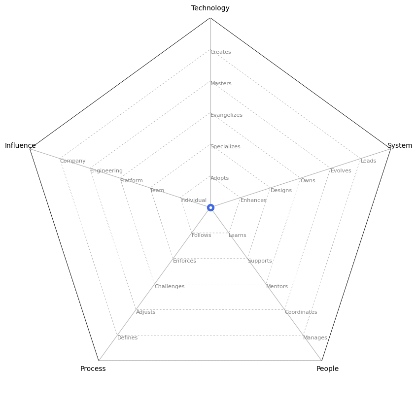

# Data Science Career Ladders

##### [Article](https://anitamehrotra.medium.com/data-science-career-ladders-6814fa0a8cc) | [Getting Started](#getting_started) | [Level Progression](#level_progression)
##### [Original Version](https://github.com/anitameh/data-science-career-ladders)

## Getting Started

<picture>
  
</picture>

##### 1. 레벨과 영역 (카테고리)

* 개인의 능력이나 성장이 모든 영역에서 동일한 속도나 레벨로 발전할 것이라고 기대하지 않습니다. 실제로 한 사람이 모든 카테고리에서 동일한 레벨에 위치하는 것은 매우 드믑니다. 각 개인이 자신의 강점과 약점을 가지고 있으며, 이에 따라 다양한 영역에서 다른 속도로 발전할 수 있습니다.
* 오히려, 여러분의 레벨은 현재 대부분(3개 이상)의 카테고리가 특정 레벨에 속하는지 여부에 따라 결정됩니다.
* 각 카테고리에서 이 레벨에 있기 위한 최소 요구 사항은 해당 카테고리의 항목에 설명되어 있습니다.

##### 2. IC(개인 기여자)와 관리자 경로의 분리 설명
* 데이터 사이언티스트 6 레벨에서 경로가 두 갈래로 나뉩니다. 하나는 관리 경로이고, 다른 하나는 개인 기여자(IC) 경로입니다.
* 여기서 기대치는 크게 상승합니다: 6 이후 레벨은 이전 레벨과 다른 직무 역할을 나타내는 것으로 간주될 수 있습니다.
* 그러나 두 경로 모두에서 광범위한 리더십을 요구합니다. 이는 사고 리더십을 필요로 하며, 기술 내외부의 사람들 그룹을 동원해 점점 더 큰 성과를 이루는 능력을 요구합니다.
* 여기서 스스로에게 물어봐야 할 질문은 "나는 더 크고 나은 시스템을 구축하고 싶은가, 아니면 더 크고 나은 팀을 관리하고 싶은가?"입니다.

이 설명은 경력 발전의 중요한 분기점에서의 선택에 대해 설명합니다. 개인 기여자(IC) 경로는 전문 기술 또는 분야에 대한 깊은 이해와 복잡한 문제 해결에 초점을 맞추며, 관리 경로는 팀 빌딩, 리더십 발휘, 전략적 계획 및 실행 등을 통해 조직의 목표 달성에 기여하는 데 중점을 둡니다. 이 선택은 개인의 성향, 역량 및 경력 목표에 따라 달라질 수 있습니다.

##### 3. 왜 7-8개의 레벨이 있나요, 그리고 이 숫자는 어디에서 왔나요?
* 이 경력 사다리는 Rent the Runway, Foursquare, Google, Airbnb, StitchFix, Amazon 등이 활용한 훌륭한 엔지니어링 사다리와 최고의 실천법을 크게 참고하여 만들어졌습니다. 이들 대부분의 사다리는 대략 7-8개의 레벨로 수렴하는 경향이 있었으며, 이는 이 사다리에서도 비슷하게 반영됩니다.
* 현재까지 우리가 알기로는 공개적으로 사용할 수 있는 데이터 과학 경력 사다리는 없습니다. 그래서 이 사다리들은 인사 부서, 데이터 과학 팀 리더 및 인사 관리자들과 함께 수십 번 반복 논의하고 정제되어 만들어졌습니다.
* 이 사다리들이 시간이 지남에 따라 발전할 것으로 전적으로 예상됩니다! 팀 내의 개인들이 더 많은 레벨이 추가되어야 한다고 믿거나, 팀과 업계의 현재 상태를 반영하기 위해 줄여야 한다고 생각한다면, 이는 팀이 논의하고 적절히 통합해야 할 사항입니다.
* 고위 경영진은 레벨링 위에 있거나 레벨링 외부에 있을 가능성이 높습니다(이것이 레벨 9의 "가벼움"의 이유입니다).

##### 4. 주목할 만한 몇 가지 사항들

* 중요하게, 여러분이 경력을 쌓아가면서 최고 수준에서 역할을 수행하는 데 필요한 핵심 기술들이 배달(delivery), 영향력(impact), 그리고 소통 및 리더십을 중심으로 한 카테고리에서 요구되는 경향이 있음을 알게 될 것입니다. 이는 여러분이 추구하는 트랙에 관계없이 마찬가지입니다.
* 물론, 이러한 기술들은 핵심적인 기초 기술 위에 구축되며, 업계 전반의 기술 변화에 발맞춰 자신만의 방법/과정/작업 방식을 설정하는 것이 기대됩니다(사다리에서 설명한 바와 같이).
* 그러나, 여러분이 경력을 쌓아가면서 팀원 및 팀 리더로서의 핵심 역량은 협력 기술과 공감 능력에 크게 의존할 것이며, 이는 팀의 가치와 일치해야 합니다.
* 데이터 사이언티스트 IV에서 데이터 사이언티스트 V로 승진하기 전에, 개인이 소대 리더로서 책임과 책무를 경험하는 것이 _매우 권장됩니다_. 이는 여러분이 현재 관심을 가지고 추구하고자 하는 트랙에 대해 더 효과적으로 정보에 입각한 결정을 내릴 수 있게 해줄 것입니다.

<!-- 이 내용은 경력 발전 과정에서 중요한 기술과 경험, 그리고 가치에 대한 인식을 강조합니다. 특히, 최고 수준에서 성공하기 위해 필요한 기술이 단순히 기술적인 것만이 아니라, 팀 내외부와의 협력, 영향력 발휘, 효과적인 소통 및 리더십에 더 중점을 둔다는 점을 강조합니다. 또한, 리더십 역할을 맡기 전에 실제 책임과 책무를 경험하는 것이 중요하다고 조언합니다. -->

## 2. Level Progression

##### [Data Scientist 2](#ds1) | [Data Scientist 3](#ds2) | [Data Scientist 4](#ds3) | [Data Scientist 5](#ds4) | [Data Scientist 6](#ds5) | [Data Scientist 7](#ds6) | [Data Scientist 8](#ds7)

### 데이터 사이언티스트 2

[맨 위로 돌아가기](#level_progression)

**영향력 및 영향**
- 과정과 결과에 대한 명확한 지침을 받아 우선순위를 정하고 업무를 완료할 수 있음
- 팀의 관행, 절차 및 도구(e.g. 애자일, 데이터 사이언스 쿠키 커터 저장소, 파일 경로 명명 규칙 등)를 효과적으로 활용하여 작업을 완료하고 반복적인 실수를 최소화함
- 역할에 필요한 핵심 기술과 지식을 개발하고 적용하기 시작함(e.g. 소스 제어/편집기, 빌드 시스템, 유닛 테스트, 자가 문서화 코드 등 학습)

**리더십 및 팀워크**
- 회사의 핵심 가치와 원칙을 업무 접근 방식 및 이해관계자, 고객, 팀원과의 파트너십에 반영함
- 유연성을 보이고 일상적인 책임을 돕기 위해 즉각적인 역할을 넘어섬

**소통**
- 팀에 상태를 효과적으로 전달함

**소프트웨어 개발 및 엔지니어링 기술**
- 팀 및 회사의 기존 tool, 자원 및 프로세스를 학습하고 사용하는 데 중점을 둠, 소프트웨어 개발에서의 이전 경험을 바탕으로 함

**통계적 추론 및 수학적 모델링**
- 기본적인 통계 개념에 대한 광범위한 지식을 보유(학사 학위 수준)

### 데이터 사이언티스트 3

[맨 위로 돌아가기](#level_progression)

**영향력 및 영향**
- 과정과 결과에 대한 명확한 지침을 받아 우선순위를 정하고 업무를 완료할 수 있음
- 팀의 관행, 절차 및 도구(e.g. 애자일, 데이터 사이언스 쿠키 커터 저장소, 파일 경로 명명 규칙 등)를 효과적으로 활용하여 작업을 완료하고 반복적인 실수를 최소화함
- 역할에 필요한 핵심 기술과 지식을 개발하고 적용하기 시작함(e.g. 소스 제어/편집기, 빌드 시스템, 유닛 테스트, 자가 문서화 코드 등 학습)
- 작은부터 중간 크기의 기능에 대한 기술 설계부터 완성까지 소유하고 있음
- 막혔을 때 도움을 요청하는 시기를 알고, 스스로 해결할 수 있음

**리더십 및 팀워크**
- 회사의 핵심 가치와 원칙을 업무 접근 방식 및 이해관계자, 고객, 팀원과의 파트너십에 반영함
- 유연성을 보이고 일상적인 책임을 돕기 위해 즉각적인 역할을 넘어섬

**소통**
- 팀에 상태를 효과적으로 전달함
- 가정을 명확히 전달하고, 업무에 대한 명확화를 사전에 얻어 재작업의 필요성을 최소화하며, 자신의 업무 요구사항에 발견된 문제를 목소리 냄
- 자신의 업무가 더 큰 프로젝트에 어떻게 맞는지 외부의 개인들에게 이해시킬 수 있음
- 다른 사람들로부터 피드백을 요청하는 데에 열정을 보이며, 동시에 동료와 관리자에게 시기적절하고 도움이 되는 피드백을 제공함
- 목표 충돌이 불가피한 상황에서 협력, 타협, 명확한 소통을 통해 공감을 적극적으로 보임

**소프트웨어 개발 및 엔지니어링 기술**
- 팀 및 회사의 기존 도구, 자원 및 프로세스를 학습하고 사용하는 데 중점을 둠, 소프트웨어 개발에서의 이전 경험을 바탕으로 함
- 지도를 받으며 정확하고 깨끗한 코드를 작성하려고 노력하며, 업계 및 팀 전체에서 언급된 최고의 실천법을 일관되게 따르려고 함
- 빠르게 학습하는 능력을 보이며, 더 선임 엔지니어로부터 지속적인 중요한 피드백 없이도 꾸준한 진전을 이루려고 노력함
- 지도를 받으며 기능의 기술 설계에 참여함

**통계적 추론 및 수학적 모델링**
- 기본적인 통계 개념에 대한 광범위한 지식을 보유(학사 학위 수준)
- 이 단계에서의 주요 초점은 통계학자로서 성장하는 것이며, 예를 들어 회사의 도구/자원/프로세스 학습 및 데이터 과학자와 데이터 엔지니어 간의 관계 이해
- 기계 학습 모델과 기존 라이브러리의 기본 가정과 메커니즘, 해당 모델의 개발 이론을 이해하려고 노력함
- 데이터 정제가 데이터 과학 작업의 대부분을 차지한다는 것을 완전히 이해하며, 업계, 회사, 그리고 자신의 소대 및 팀 내에서 언급된 최고의 실천법을 일관되게 따르려고 함
- 지도를 받으며 통계적 설계에 적극적으로 참여함; 이는 특성 생성, 모델 선택, 가정 검정을 포함함
- 관리자와 특정 모델링 영역에서 심층적인 전문 지식을 개발하는 것을 선택하거나 모델링 영역의 경험 범위를 개발하는 것의 이점/단점에 대해 정기적으로 대화를 나눔

### 데이터 사이언티스트 4

[맨 위로 돌아가기](#level_progression)

**영향력 및 영향**
- 장애물에 직면했을 때 끈기를 보이며, 필요할 경우 다른 사람들을 끌어들여 신속하게 문제를 해결함
- 명시적으로 할당되기 전에 문제를 해결하려는 주도성을 보임
- 점점 더 복잡한 제품 기능을 제공하며, 이들이 잘 준비되고 버그가 없다고 믿음

**리더십 및 팀워크**
- 자신의 작업이나 타인의 작업에서 문제점/위험을 식별하고 표현할 때 개념 증명/테스트/외부 연구를 통해 경험적 증거를 찾고 사용함
- 자신의 팀에서 완료된 작업이 비즈니스에 미치는 영향과 영향을 받는 비즈니스 단위를 이해하며, 그 이해를 바탕으로 모든 당사자의 요구를 고려한 요구사항을 주도함
- 구축되는 소프트웨어의 사용자에 대한 공감을 일관되게 보이며, 그것을 의사 결정의 지침으로 사용함

**소통**
- 디자인 문서, 기술 토크, 내부 팀 위키를 통해 정기적이고 효과적으로 기술 결정을 전달함
- 기능 그룹 간에 소통하는 연습을 통해 효과적인 크로스 그룹 커뮤니케이션을 더 잘하기 위해 노력하며, 결국 다양한 그룹과 다양한 인센티브 구조(e.g. 제품 관리, 이해관계자 등)를 가진 개인 및 팀과 잘 협력할 수 있는 능력을 갖춤
- 자신의 작업과 인접 작업(예: 명확하지 않음, 일관성 없음, 기술적 제한 등)에 대한 요구사항의 도전을 적극적으로 식별하고 목소리를 냄

**소프트웨어 개발 및 엔지니어링 기술**
- 지도를 받으며 자신의 팀 또는 더 큰 팀의 코드베이스의 다른 영역에서 기여하고 작업할 수 있음

**통계적 추론 및 수학적 모델링**
- 자신의 데이터 과학 작업 영역에서 잘 이유가 근거한 설계 결정과 타협을 이해하고 만듦
- 최소한의 지도 없이 현재 데이터 소스를 파고들고, 필요한 추가 소스에 대해 아이디어를 내며 명확한 격차가 있는 곳을 식별할 수 있는 능력을 보임
- 반복적인 데이터 과학 사이클의 본질적인 초기 모호성에 편안하며, 독립적으로 모델링 및 분석 작업을 수행함
- 필요한 경우 새로운 데이터 처리 기술을 식별하고 배우는 능력을 보임
- 일관되게 독립적으로 문제를 해결하고 문제를 디버깅/해결할 수 있음
- 업계 동향, 팀 및 회사의 인프라 및 빌드 시스템(bitbucket / git / 4D 포함)에 대한 지식을 보임

### 데이터 사이언티스트 5

[맨 위로 돌아가기](#level_progression)

**영향력 및 영향**
- 장애물에 직면했을 때 끈기를 보이며, 필요할 경우 다른 사람들을 끌어들여 신속하게 문제를 해결함
- 명시적으로 할당되기 전에 문제를 해결하려는 주도성을 보임(이는 해당 팀에서 이러한 문화가 장려된다고 가정)
- 점점 더 복잡한 제품 기능을 제공하며, 이들이 잘 준비되고 버그가 없다고 믿음
- 제품의 구성 요소 또는 전체 제품에 대한 종단간 책임을 가지며, 시간이 지남에 따라 점점 복잡해지는 제품에 기여함
- 기술적 부채를 "너무 큰" 즉, 해결하기 위해 상당한 사전 작업이 필요한 부채가 되기 전에 적극적으로 식별하고 해결함
- 일을 잘 정의된 이정표로 범위를 정하고 단계를 나누어 모놀리식 결과물을 피함; 정확한 타임라인 추정을 지속적으로 작업하고 그 추정치에 따라 제공함
- 자신의 제품에 대한 기술 테스트와 성능 측정을 소유하며, 드라마 없는 출시로 명성을 쌓아가고 있음

**리더십 및 팀워크**
- 자신의 작업이나 타인의 작업에서 문제점/위험을 식별하고 표현할 때 개념 증명/테스트/외부 연구를 통해 경험적 증거를 찾고 사용함
- 페어링, 디자인 및 코드 리뷰를 통해 신입 엔지니어 및 팀원에게 멘토링을 제공함
- 자신의 팀에서 완료된 작업이 비즈니스에 미치는 영향과 영향을 받는 비즈니스 단위를 이해하며, 그 이해를 바탕으로 모든 당사자의 요구를 고려한 요구사항을 주도함
- 구축되는 소프트웨어의 사용자에 대한 공감을 일관되게 보이며, 그것을 의사 결정의 지침으로 사용함
- 고영향("중요한") 문제를 식별하고 해결하기 위해 주도적으로 나서며, 교차 기술 이슈에 대해 타인과 협력함
- 프로젝트/서비스 수준에서 방향을 설정하는 데 도움을 주며, 일관되게 팀 수준에서 의사 결정에 영향을 줌
- 요청될 때 도움을 제공함으로써 팀 수준에서 학습 문화에 기여함

**소통**
- 디자인 문서, 기술 토크, 내부 팀 위키를 통해 정기적이고 효과적으로 기술 결정을 전달함
- 기능 그룹 간에 소통하는 연습을 통해 효과적인 크로스 그룹 커뮤니케이션을 더 잘하기 위해 노력하며, 결국 다양한 그룹과 다양한 인센티브 구조(e.g. 제품 관리, 이해관계자 등)를 가진 개인 및 팀과 잘 협력할 수 있는 능력을 갖춤
- 자신의 작업과 인접 작업에 대한 요구사항의 도전을 적극적으로 식별하고 목소리를 냄(예: 명확하지 않음, 일관성 없음, 기술적 제한 등)
- 코드 리뷰, 문서화, 기술 지도, 멘토링을 통해 팀원이 개인 기여자로서 성장하고 개선하도록 돕기 위해 노력함(또는 프로젝트의 기술 리더로서 역할을 수행함)
- 업계 전반에 걸쳐 그리고 팀 전체에 최고의 표준을 설정하고 소통함
- 모델 또는 아키텍처 리뷰 그룹에 참여하기를 추구함
- 기술적, 분석적 및 제품 필요성 간의 트레이드오프를 이해하고, 이러한 모든 필요성을 고려한 "최선"의 해결책을 소통함
- 자신의 팀에 영향을 미치는 기술 문제에 대한 해결책에 대한 동의를 얻는 방법을 배우고 있음
- 자신의 팀에 영향을 미치는 기술 문제에 대한 전략을 적극적으로 식별하고 제안함
- 지속적으로 피드백을 요청하며, 자신의 핵심 영역 외의 프로젝트에 대한 팀원 및 소대원에게 유용한 피드백을 제공함

**소프트웨어 개발 및 엔지니어링 기술**
- 지도를 받으며 자신의 팀 또는 더 큰 팀의 코드베이스의 다른 영역에서 기여하고 작업할 수 있음

**통계적 추론 및 수학적 모델링**
- 자신의 데이터 과학 작업 영역에서 잘 이유가 근거한 설계 결정과 타협을 이해하고 만듦
- 최소한의 지도 없이 현재 데이터 소스를 파고들고, 필요한 추가 소스에 대해 아이디어를 내며 명확한 격차가 있는 곳을 식별할 수 있는 능력을 보임
- 반복적인 데이터 과학 사이클의 본질적인 초기 모호성에 편안하며, 독립적으로 모델링 및 분석 작업을 수행함
- 필요한 경우 새로운 데이터 처리 기술을 식별하고 배우는 능력을 보임
- 일관되게 독립적으로 문제를 해결하고 문제를 디버깅/해결할 수 있음
- 업계 동향, 팀 및 회사의 인프라 및 빌드 시스템(bitbucket / git / 4D 포함)에 대한 지식을 보임
- 통계학 또는 기계 학습의 특정 영역이나 제품을 구축하는 데 사용되는 구성 요소/블록에 대한 지침을 위해 찾아짐
- 다양한 모델링 기술을 구현할 때 발생할 수 있는 잠재적 도전과 기술적 문제를 예상하며, 이를 피하기 위한 데이터 및 모델 구현 설계 결정을 내림
- 우리 코드베이스의 큰 부분에 대한 소유자 및 전문가임
- 파트너 팀으로부터 데이터 과학 문제 정의를 이끌어내고 그들로부터 합의 및 조율을 달성함
- 제품 요구사항을 매핑하여 구축해야 할 알고리즘/모델 출력을 결정할 수 있음

### 데이터 사이언티스트 6

[맨 위로 돌아가기](#level_progression)

|                                                 | 개인 기여자(IC)                                                                                                                                                                                                                                                                                                                                                                                                                                                      | 관리자                                                                                                                                                                                                                                                                                                                                                                                                                                                             |
|-------------------------------------------------|---------------------------------------------------------------------------------------------------------------------------------------------------------------------------------------------------------------------------------------------------------------------------------------------------------------------------------------------------------------------------------------------------------------------------------------------------------------------|--------------------------------------------------------------------------------------------------------------------------------------------------------------------------------------------------------------------------------------------------------------------------------------------------------------------------------------------------------------------------------------------------------------------------------------------------------------------|
| **영향력 및 영향**                            | 프로젝트, 서비스 및 프로세스의 복잡성을 지속적으로 줄여 더 적은 노력으로 더 많은 일을 할 수 있으며, 핵심 및 부수적 프로젝트에 대한 기여로 명성을 쌓아가고 있음                                                                                                                                                                                                                                                                                                                                                               | 팀이 가장 영향력 있는 프로젝트에 집중할 수 있도록 우수하게 이끌며, 팀을 위한 장애물을 적극적으로 식별하고 제거함                                                                                                                                                                                                                                                                                                                                                                                                          |
|                                                 | 여러 대규모 제품이나 서비스, 복잡한 라이브러리 또는 주요 인프라/소프트웨어를 소유하고 출시함                                                                                                                                                                                                                                                                                                                                                                           | 관련 제품 이해관계자 및 사용자와 효과적으로 협력하여 기술 구성요소의 제품 로드맵 범위를 관리함; 팀이 불필요한 "소음"으로부터 보호받을 수 있도록 함                                                                                                                                                                                                                                                                                                                                                                           |
|                                                 |                                                                                                                                                                                                                                                                                                                                                                                                                                                                     | 코드 리뷰, 버그 수정, 소규모 기능 구축에 기여하면서 팀의 병목 현상이 되지 않음                                                                                                                                                                                                                                                                                                                                                                                        |
|                                                 |                                                                                                                                                                                                                                                                                                                                                                                                                                                                     | 채용 노력을 주도하며 팀의 인력 요구 사항을 조기에 결정하고 목소리를 냄                                                                                                                                                                                                                                                                                                                                                                                              |
| **리더십 및 팀워크**                         | 전사 기술 방향성에 긍정적인 영향을 명확하게 끼침                                                                                                                                                                                                                                                                                                                                                                                                                      | 독립적으로 팀원을 관리하면서 리더십 스타일을 개발하고 반복하는 데 집중하며, 보고자가 책임과 책무를 갖고 업무를 수행할 수 있도록 신뢰 문화를 구축함                                                                                                                                                                                                                                                                                                                |
|                                                 | 제품 개발 계획과 그것이 더 큰 팀 제품 생태계에 어떻게 맞는지 전략적으로 생각하며, 그 사고를 바탕으로 제품 자체와 다른 팀 제품에 대한 광범위한 아키텍처 결정을 형성함                                                                                                                                                                                                                                                                                                | 다양한 기술 세트, 기술 관심 영역 및 작업 방식을 가진 팀원을 관리하는 능력을 개발하고 있으며, 불가피한 "실패"와 실수에 대해 편안해지기 위해 적극적으로 노력하고 있음. 이는 팀원에게 장기간에 걸쳐 그것을 문제삼지 않음                                                                                                                                                                                                                                            |
|                                                 | 모든 구성원에 대한 멘토십 및 포용 문화에 기여함으로써 강력한 멘토십 및 포용 문화를 구축하며, 참석하지 않는 회의에서 개인을 옹호함                                                                                                                                                                                                                                                                                                                                    | 주요 이니셔티브를 명확한 타임라인으로 전달을 주도하며, 상위 관리층에 요구사항을 조기에 제시함                                                                                                                                                                                                                                                                                                                                                                       |
|                                                 |                                                                                                                                                                                                                                                                                                                                                                                                                                                                     | 전략적 기술 부채 영역을 지속적으로 식별할 수 있으며, 이를 제거하기 위한 비용 / 이익 분석을 제공함. 예를 들어, 우선 순위를 정하는 방법에 대한 타임라인 개발                                                                                                                                                                                                                                                                                                          |
|                                                 |                                                                                                                                                                                                                                                                                                                                                                                                                                                                     | 모든 구성원에 대한 멘토십 및 포용 문화에 기여함으로써 강력한 멘토십 및 포용 문화를 구축하며, 참석하지 않는 회의에서 개인을 옹호함                                                                                                                                                                                                                                                                                                                                   |
| **소통**                                   | 적극적으로 듣고, 합의에 도달하는 데 도움이 되는 토론을 안내할 수 있으며, 결정이 내려지면 그 결정을 명확하게 소통하고 지지함                                                                                                                                                                                                                                                                                                                                          | 적극적으로 듣고, 합의에 도달하는 데 도움이 되는 토론을 안내할 수 있으며, 결정이 내려지면 그 결정을 명확하게 소통하고 지지함                                                                                                                                                                                                                                                                                                                                          |
|                                                 | 개인 기여자가 업무를 소유하고 책임과 책무를 지도록 장려하여 신뢰의 문화를 조성하는 데 리더십을 발휘함                                                                                                                                                                                                                                                                                                                                                                | 팀원에게 조직 및 비즈니스 맥락을 소통함                                                                                                                                                                                                                                                                                                                                                                                                                             |
|                                                 | 횡단 팀 작업을 촉진함으로써 타인의 효과를 배가시킴                                                                                                                                                                                                                                                                                                                                                                                                                      | 정보를 아래로 전달하고 위로 올리는 연결 고리 역할을 하며, 특히 기대를 소통할 때 명확성을 제공하고, 참석하지 않는 회의에서 팀원을 옹호함                                                                                                                                                                                                                                                                                                                            |
|                                                 | 팀의 단기 및 중기 전략적 기술 방향을 설정하는 데 기여함                                                                                                                                                                                                                                                                                                                                                                                                               | 역할을 "연결자"로 정제하여 개인 팀원이 그들의 기술과 "더 어려운" 기술을 개발할 수 있도록 도움을 주는 사람, 자원 등에 연결하는 데 도움을 줌                                                                                                                                                                                                                                                                                                                         |
|                                                 | 향후 6-12개월을 내다보고 가장 큰 필요성이 있는 영역에 해결책을 식별하고 배치하는 계획을 동시에 시작하고 실행함                                                                                                                                                                                                                                                                                                                                                            | 팀원 개개인의 직업 및 개인적 목표를 이해하려고 노력하며, 그들의 팀원의 실용적인 목표와 OKR을 개발하는 데 구체적인 지침을 제공하는 데 도움을 줌                                                                                                                                                                                                                                                                                                                       |
|                                                 | 동료 팀원, 리더십으로부터 지속적이고 적극적으로 피드백을 요청하며, 받은 피드백에 따라 행동함                                                                                                                                                                                                                                                                                                                                                                           | 주니어 팀원, 동료 및 리더십으로부터 지속적으로 적극적으로 피드백을 구하며, 받은 피드백에 따라 행동함                                                                                                                                                                                                                                                                                                                                                               |
|                                                 |                                                                                                                                                                                                                                                                                                                                                                                                                                                                     | 어려운 대화를 나누고 구체적이고 구체적이며 유용한 피드백을 제공하는 기술을 적극적으로 개발함. 이는 상황에 맞는 방법(이는 통신 채널과 타이밍을 포함하며, 개별 팀원에게 특정되며, 단지 공식적인 회사 중간 및 연말 평가에만 제한되지 않음)                                                                                                                                                                                                                         |
|                                                 |                                                                                                                                                                                                                                                                                                                                                                                                                                                                     | 개인 팀원의 경력 및 개인적 목표를 이해하려고 노력하며, 그들의 팀원의 실용적인 목표와 OKR을 개발하는 데 구체적인 지침을 제공하는 데 도움을 줌                                                                                                                                                                                                                                                                                                                       |
| **소프트웨어 개발 및 엔지니어링**            | 전문 분야에서 기술적 지도를 제공함; 종종 지도를 구하기 위해 찾아짐                                                                                                                                                                                                                                                                                                                                                                                                   | 필요한 경우 새로운 기술을 사용하거나 능동적으로 식별된 기술 문제를 해결하는 데 관심이 있는 팀원에게 지도를 제공함                                                                                                                                                                                                                                                                                                                                                    |
|                                                 | 제품 수준에서 기술적 문제를 예상하고 이를 피하기 위해 아키텍처 및 설계 결정을 내림                                                                                                                                                                                                                                                                                                                                                                                    |                                                                                                                                                                                                                                                                                                                                                                                                                                                                      |
| **통계적 추론 및 수학적 모델링** | 데이터 엔지니어와 데이터 사이언티스트 간의 관계/조직 구조를 효과적으로 관리하여 양측이 동등하게 권한을 갖고, 데이터 사이언티스트와 인터페이스할 때 제품 수준에서 기술적 문제를 예상함                                                                                                                                                                                                                                                                                   | 관련성이 있는 적절한 핵심 성과 지표와 측정 가능한 목표를 일관되게 설정하는 중요성을 이해함                                                                                                                                                                                                                                                                                                                                                                          |
|                                                 | 전문 분야에서 통계적 지도를 제공함; 종종 지도를 구하기 위해 찾아짐                                                                                                                                                                                                                                                                                                                                                                                                    | 다른 소대 간의 제품 요구사항을 목소리 내고 대규모 팀의 로드맵에 매핑하는 기술을 개발함                                                                                                                                                                                                                                                                                                                                                                              |
|                                                 | 제품 수준에서 모델링과 관련된 문제를 예상함, 이는 윤리적 함의, 제품 사용자의 행동에 대한 영향, 데이터의 편향, 모델링 구현의 가정을 포함하며, 이를 피하기 위한 데이터 및 모델링 설계 결정을 내림                                                                                                                                                                                                                                                                      | 전문 분야에서 기술적 지도를 제공함; 종종 지도를 구하기 위해 찾아짐                                                                                                                                                                                                                                                                                                                                                                                                |
|                                                 | 자신이 구축하는 제품과 관련된 데이터 과학 도메인의 큰 부분의 소유자 및 전문가임. 예를 들어, 다양한 데이터 소스에서 기능의 정의/개념/유도, 수행된 탐색적 분석, 테스트 중인 모델의 근거, 생성된 데이터의 유용성 및 비즈니스 영향                                                                                                                                                                                                                                         | 애자일 소프트웨어 개발 및 관리의 견고한 기초를 개발하고 이를 적극적으로 실천함(예: 명확한 티켓 작성 포함); 필요한 경우 팀원에게 지도를 제공함                                                                                                                                                                                                                                                                                                                     |
|                                                 | 팀 내 모델 검토 위원회에 앉아 회사 전반의 표준에 따라 승인 및 문서화를 추진함                                                                                                                                                                                                                                                                                                                                                                                     | 팀 전반적인 수준에서(최소한) 관련 기술 문서에 대한 구체적이고 시기적절한 피드백을 지속적으로 제공함                                                                                                                                                                                                                                                                                                                                                                  |
|                                                 | 파트너 팀으로부터 데이터 과학 문제 정의를 이끌어내고 그들로부터 합의 및 조율을 달성함                                                                                                                                                                                                                                                                                                                                                                                     |                                                                                                                                                                                                                                                                                                                                                                                                                                                                      |
|                                                 | 제품 요구사항을 기술 솔루션에 지속적으로 매핑하며, 이 지식을 사용하여 구현 및 전달될 최종 알고리즘을 정제하고 결정함                                                                                                                                                                                                                                                                                                                                                      |                                                                                                                                                                                                                                                                                                                                                                                                                                                                      |

### 데이터 사이언티스트 7

[맨 위로 돌아가기](#level_progression)

|                                                     | 개인 기여자(IC)                                                                                                                                                                                                                                                           | 관리자                                                                                                                                                                                                                                                                                                             |
|-----------------------------------------------------|----------------------------------------------------------------------------------------------------------------------------------------------------------------------------------------------------------------------------------------------------------------------------|---------------------------------------------------------------------------------------------------------------------------------------------------------------------------------------------------------------------------------------------------------------------------------------------------------------------|
| **영향력 및 영향**                            | 하나 이상의 팀의 기여를 포함한 대규모 시스템을 시간 내에, 고품질로 일관되게 전달할 수 있음                                                                                                                                                                                 | 팀의 신흥 고객 요구에 부합하는 고속도, 고성능 개발 조직을 구축하기 위한 새로운 전략을 개발하고 배포함                                                                                                                                                                                                                   |
|                                                     | 복잡한 문제를 잠재적 해결책, 알려진 사항 및 알려지지 않은 사항으로 신속하게 분해하여 포괄적이고 효율적인 해결책에 도달하는 기술을 개발함                                                                                                                                              | 기술 혁신을 위한 유리한 환경을 일관되게 구축하고 지원하는 데 집중함                                                                                                                                                                                                                                                  |
|                                                     | 팀이 마주칠 수 있는 기술적으로 가장 복잡한 문제를 디버깅하는 능력을 계속해서 개발함                                                                                                                                                                                         | 데이터 과학 조직/팀의 기술이 지속 가능한 경쟁 우위로 활용될 수 있도록 개발 표준의 생성/지속적인 개선/활발한 집행을 주도함                                                                                                                                                                                               |
|                                                     |                                                                                                                                                                                                                                                                            | 선발된 인재를 모집하고, 성과 평가 및 교육 및 경력 개발을 주도하거나 존경받는 활동적인 참여자로 명성을 쌓는 데 중점을 둠                                                                                                                                                                                              |
|                                                     |                                                                                                                                                                                                                                                                            | 조직의 여러 영역에 대한 모든 인력 계획 및 인사 진화를 책임지며, 필요한 경우 조직의 벤더 및 외부 관계를 관리함; 이러한 결정의 비용과 가치 추가를 일관되게 정량화하고 데이터 과학 조직/팀의 예산 과정에 어떤 영향을 미치는지를 계산함                                 |
|                                                     |                                                                                                                                                                                                                                                                            | 팀원의 재능을 적극적으로 육성하고 개선 영역에 대한 지침을 제공하여 리더십을 제공함                                                                                                                                                                                                                                     |
|                                                     |                                                                                                                                                                                                                                                                            | 비즈니스 목표와 기술 부채 간의 균형을 결정하는 데 있어 일관성 있는 의사 결정을 개발하고 이 지식을 사용하여 기술, 자원 및 인력 문제를 해결함                                                                                                                                                                             |
|                                                     |                                                                                                                                                                                                                                                                            | 수행되는 작업의 목적을 명확하게 이해하고, 데이터 과학 조직/팀 및 회사의 가치와 일치하도록 작업의 우선 순위를 일관되게 지정하고(그리고 우선 순위 지정을 소통함)                                                                                                                                                            |
|                                                     |                                                                                                                                                                                                                                                                            | 전략적 격차를 채우는 해결책을 지속적으로 목소리 높여 옹호함                                                                                                                                                                                                                                                           |
|                                                     |                                                                                                                                                                                                                                                                            | 고기능 및 동기 부여된 팀을 지원하는 문화를 구축하고 유지함                                                                                                                                                                                                                                                             |
| **리더십 및 팀워크**                         | 데이터 과학 조직의 전체적으로 중요한 영역에 대한 다중 시스템 및 팀을 포괄하는 다년간의 기술 전략을 개발하고 반복하는 데 핵심 역할을 함                                                                                                                                                      | 고객, 고위 경영진 및 기타 비즈니스 리더와 공감을 바탕으로 효과적으로 협력하기 위해 과거 경험과 강한 커뮤니케이션 기술을 활용함                                                                                                                                                                                         |
|                                                     | 이러한 결정은 팀의 장기적 성공 또는 실패에 직접적인 영향을 미치기 때문에 증거에 기반한, 미묘한 결정을 내리는 것으로 명성을 쌓음                                                                                                                                                                      | 데이터 과학 조직과 회사에 합류할 잠재적인 신입사원을 영감을 줌                                                                                                                                                                                                                                                         |
|                                                     | 여러 가능한 미래를 지원할 수 있는 유연한 아키텍처를 만들고 이끌며, 이러한 행동 패턴을 살아내고 팀이 이 패턴을 따르도록 영감을 줌                                                                                                                                                                        | 자신이 감독하는 팀의 OKR 설정 및 검토 프로세스를 소유함                                                                                                                                                                                                                                                                |
|                                                     | 팀 내의 주니어 멤버가 발언할 때 "특권"을 제공하고, 사이에서 듣기를 통해 포용의 문화를 구축하고 강화함으로써 개인이 그룹 회의에서 발언하도록 장려함                                                                                                                                                      | 팀 내의 주니어 멤버가 발언할 때 "특권"을 제공하고, 사이에서 듣기를 통해 포용의 문화를 구축하고 강화함으로써 개인이 그룹 회의에서 발언하도록 장려함                                                                                                                                                                     |
| **소통**                                   | 데이터 과학 조직이 외부적으로 공유할 수 있는 영역(예: 훌륭한 작업)을 일관되게 식별하며, 그러한 영역 주변의 콘텐츠 생성을 소통하거나 안내함                                                                                                                                                             | 비즈니스 이해관계자에게 기술 개념을 신뢰할 수 있게 소통할 수 있으며, 감독하는 기술 팀에 정기적으로 비즈니스 목표를 소통함                                                                                                                                                                                                                           |
|                                                     | 정책/패턴 도입, 시스템 또는 통신 도구 작성 등 "곱셈자" 역할을 주로 수행하여 데이터 과학 조직/팀의 모든 구성원의 생산성을 높임                                                                                                                                                                        | 법무 팀과 협력하여 정책 설정 및 표준 설정에 참여하고 사건에 대응(능동적 및 수동적)                                                                                                                                                                                                                                      |
|                                                     | 데이터 과학 팀 수준 및 회사 수준에서 기술의 주요 영역 방향에 대한 내부 대화를 일관되게 주도하며, 이 방향에 대한 팀 전체의 합의를 구축하고 이 방향을 사용하여 엔지니어에게 영감을 줌                                                                                                                        |                                                                                                                                                                                                                                                                                                                         |
|                                                     | 팀 내 모든 기술 멤버에게 롤 모델 및 멘토로 여겨짐                                                                                                                                                                                                                                                                         |                                                                                                                                                                                                                                                                                                                         |
| **소프트웨어 개발 및 엔지니어링**            |                                                                                                                                                                                                                                                              | 조직이 적절하게 높은 기술 역량을 갖추도록 보장하며, 우수함을 추구함                                                                                                                                                                                                                                                     |
|                                                     |                                                                                                                                                                                                                                                              | 업계 동향과 표준을 최신 상태로 유지하기 위해 정기적으로 새로운 기술을 연구하며, 이를 바탕으로 데이터 과학 조직/팀에 적절한 솔루션을 구현하는 데 사용함                                                                                                                                                                  |
| **통계적 추론 및 수학적 모델링** | 데이터 과학 조직/팀이 지속적으로 "선두를 유지"하도록 보장하며, 해당 영역의 확장 및 신뢰성 한계를 명확히 표현할 수 있음                                                                                                                                                                       | 조직이 적절하게 높은 통계적 추론 및 수학적 모델링 역량을 갖추도록 보장하며, 우수함을 추구함                                                                                                                                                                                                                               |
|                                                     | 회사 비즈니스의 주요 부분에 대한 데이터 제품 세트를 깊이 이해하며, 이러한 이해를 바탕으로 추가 데이터 제품에 대한 기회 및 성장 영역을 식별할 수 있음                                                                                                                                                                 | 업계 동향과 표준을 최신 상태로 유지하기 위해 정기적으로 새로운 기술을 연구하며, 이를 바탕으로 데이터 과학 조직/팀에 적절한 솔루션을 구현하는 데 사용함                                                                                                                                                                  |
|                                                     |                                                                                                                                                                                                                                                              | 필요할 경우 중요 시스템의 디버깅 및 문제 해결을 돕기 위해 뛰어들 수 있는 능력을 가짐                                                                                                                                                                                                                                   |
|                                                     |                                                                                                                                                                                                                                                              | 해당 영역의 아키텍처와 비즈니스 요구 사항이 일치하도록 하는 데 필요한 올바른 질문을 제기함으로써 아키텍처에 기여하는 데 집중함                                                                                                                                                                                           |

### 데이터 사이언티스트 8*

[맨 위로 돌아가기](#level_progression)

_*고위 경영진 역할은 대부분 이 경력 사다리의 범위를 벗어나기 때문에 의도적으로 경량화되었습니다._

|                                                     | 개인 기여자(IC)                                                                                                                                                                                                                                          | 관리자                                                                                                        |
|-----------------------------------------------------|---------------------------------------------------------------------------------------------------------------------------------------------------------------------------------------------------------------------------------------------------------|---------------------------------------------------------------------------------------------------------------|
| **영향력 및 영향**                            | 회사에서 구축할 데이터 제품에 대한 팀의 전략적 비전을 개발하고, 실행하며, 옹호하고, 이에 대한 동의를 얻음                                                                                                                                              | 기술을 활용한 비즈니스 성장 기회를 식별하고 이러한 기회에 대해 실행할 수 있음                                   |
|                                                     | 최고 경영진(CTO와 동등), 제품 리더 및 기타 비즈니스 이해관계자와 협력하여 고위 전략적 비전을 명확하고 실행 가능한 기술 로드맵으로 변환함                                                                                                                 |                                                                                                               |
| **리더십 및 팀워크**                         | 분기별 비즈니스 목표를 모든 팀원이 이해할 수 있도록 노력함                                                                                                                                                                                              | 최고 데이터 책임자(CDO)에 해당                                                                                      |
|                                                     | 팀원, 이해관계자 및 회사 C-레벨에게 팀이 다음 단계로 나아갈 수 있도록 인력 및 문화적 요구 사항을 명확하고 정기적으로 전달함                                                                                                                             |                                                                                                               |
|                                                     | 모든 팀원이 전략을 실행할 수 있도록 동기를 부여하고, 임무에 맞게 조정하며, 동기를 부여하고 권한을 부여하는 데 시간을 우선적으로 할애함; 모든 팀원이 분기별 비즈니스 목표를 이해하고, 프로세스의 진화나 명확성을 위한 영역을 식별하도록 노력함 |                                                                                                               |
|                                                     | 팀이 더 나아가 발전할 수 있는 전략적 영역을 선제적으로 식별하는 데 주도적으로 참여함                                                                                                                                                                     |                                                                                                               |
|                                                     | 그룹 회의에서 개인이 발언하도록 장려하고, "특권"을 제공하며, 팀의 주니어 멤버가 발언할 때 사이사이를 듣는 것을 통해 포용의 문화를 구축하고 강화함                                                                                                           |                                                                                                               |
| **소통**                                   | 팀과 상위로 다년간의 기술 전략을 소통하며, 모든 팀원이 항상 우선순위를 명확히 알고 일상 결정을 내릴 수 있도록 충분히 명확하게 소통함                                                                                                                     | 회사 전반에 걸쳐 경영진 수준의 전략을 정기적으로 소통하며, 그것이 회사의 모든 계층에 침투하도록 노력함              |
|                                                     | 팀이 더 나아가 발전할 수 있는 전략적 영역을 선제적으로 식별하는 데 주도적으로 참여함                                                                                                                                                                     | 비즈니스 지시 사항을 기술 목표로 분해하는 데 도움을 줌                                                           |
|                                                     | 팀원, 이해관계자 및 회사 C-레벨에게 팀이 다음 단계로 나아갈 수 있도록 인력 및 문화적 요구 사항을 명확하고 정기적으로 전달함                                                                                                                             |                                                                                                               |
| **소프트웨어 개발 및 엔지니어링**            | 기술 방향을 설정함                                                                                                                                                                                                                                       |                                                                                                               |
| **통계적 추론 및 수학적 모델링** | 기술 방향을 설정함                                                                                                                                                                                                                                       | 데이터 과학 팀의 조직 우선순위를 설정하는 데 사용되는 회사 전반의 기술 방향을 설정함                              |
|                                                     | 제품 및 비즈니스 요구 사항에 초점을 맞춘 성장 결정에 기여하며, 현재 및 미래의 비즈니스 요구를 지원할 수 있는 데이터 제품을 구축할 수 있도록 도움                                                                                                         | 회사의 다양한 미래 가능성을 지원할 수 있는 데이터 제품이 구축되도록 보장함                                     |
|                                                     | 조직 및 프로세스 디버깅에 있어 가장 큰 기술적 강점을 가짐; 팀이 올바른 결정에 도달하도록 도울 올바른 질문을 아는 사람                                                                                                                                                                  |                                                                                                               |
