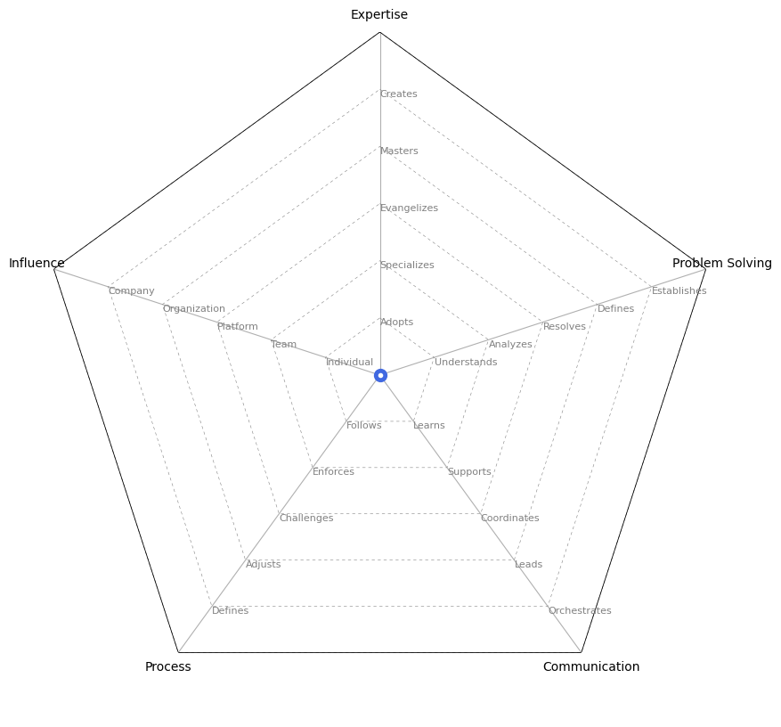

# Product Manager Ladders
<picture>
  
</picture>

#### [README](README.md)
* [Product Manager 3](Product%20Manager%203.md)

* [Product Manager 4](Product%20Manager%204.md)

* [Product Manager 5](Product%20Manager%205.md)

* [Product Manager 6](Product%20Manager%206.md)

* [Product Manager 7](Product%20Manager%207.md)

## Axes - 위 차트에 속한 5가지의 축

### Expertise: 제품 개발에 필요한 기술적 역량 및 도메인에 대한 전문성

* 프로덕트 개발에 필요한 기술 및 도메인 특정 기술을 포착하고 이해합니다. 관련 기술에 대한 숙련뿐만 아니라, 비즈니스 인사이트를 바탕으로 시장의 흐름과 제품의 사업적 가치를 명확하게 인식합니다. 이를 통해 제품 개발에서 전략적 결정을 내리고 비즈니스 성과에 기여할 수 있습니다.

### Problem Solving: 문제 해결 능력

* 복잡한 문제를 분석하고 근본 원인을 파악하며 이를 해결하기 위한 효과적인 해결책을 개발하는 능력에 중점을 둡니다. 효과적인 문제 해결 능력은 프로덕트 매니저가 도전을 극복하고 성공적인 결과를 이끌어내기 위해 필수적입니다.

### Communication: 의사소통

* 팀 내외에서 명확하고 효과적인 커뮤니케이션의 중요성을 강조합니다. 명확하고 적극적인 커뮤니케이션은 팀원 및 이해관계자 간의 협업, 일치 및 이해를 촉진하여 성공적인 결과를 이끌어냅니다.

### Process: 결과를 달성하기 위한 과정

* 효율적인 워크플로우, 시스템 및 방법론을 설계하고 구현하는 기술에 있으며, 이를 통해 전체적인 목표와 조화를 이루고 지속적인 개선을 촉진합니다. 프로세스 관리에 능숙한 프로덕트 매니저는 자원 할당을 정밀화하고 운영을 최적화하며, 원하는 결과를 효과적으로 달성하기 위해 이니셔티브를 조율할 수 있습니다.

### Influence: 역할의 영향 범위

* 이해관계자에게 영향을 미치고 의사 결정을 이끌며 의미 있는 영향을 만들어내는 능력을 강조합니다. 이해관계자에게 영향을 미치고 의사 결정을 주도함으로써 프로덕트 매니저는 의미 있는 영향을 창출하고 제품의 성공을 이끌어냅니다.

## Levels - Level을 결정하는 요소에 대한 설명

### Expertise
    

#### Adopts

* 현재의 기술과 도구를 효율적으로 사용하여 결과를 도출합니다. 현재 도구와 프로세스에 대한 기본적인 숙련도를 보여줍니다.

* 기술적 지식을 활용하여 반복적인 작업을 처리하고, 팀 목표에 효율적으로 기여합니다.
        

#### Specializes

* 새로운 기술을 배우고 적용할 기회를 적극적으로 탐색하며, 자신의 전문성을 확장하고 변화하는 요구에 적응합니다.

* 새로운 개념을 신속하게 이해하고, 이를 적용하여 팀의 생산성과 효율성을 향상시킵니다.
        

#### Evangelizes

* 팀 내에서 해당 분야의 전문가로 성장하여, 제품 방향성 결정에 중요한 역할을 합니다.

* 해당 분야에 대한 전문성을 동료들에게 공유하고, 멘토 역할을 통해 팀의 성장을 지원합니다.

* 지식 공유와 멘토십을 통해 팀 전체의 기술적 역량을 향상시킵니다.
        

#### Masters

* 플랫폼 내에서 복잡한 기술적 도전에 정통하고, 심층적인 지식과 통찰력을 제공하여 팀 내에서 의견을 구하는 주요 인물로 자리잡습니다.

* 플랫폼 제품의 혁신을 이끌며, 회사의 기술적 성장을 주도합니다.
        

#### Creates

* 조직 전반에서 전문가로 인정받으며, 회사의 제품 및 프로세스에 대한 포괄적인 지식을 보유하고 있습니다.

* 팀에 전략적인 지도와 멘토십을 제공하여, 조직의 제품 방향을 구체화하고, 대규모 혁신을 주도합니다.

### Problem Solving
    

#### Understands

* 미리 정의된 목표와 일정 내에서 결과물을 제공하여 기대되는 프로젝트 목표를 효과적으로 달성합니다.

* 주어진 작업 및 프로젝트를 효율적으로 실행하여 팀의 우선순위와 일치시키고, 품질 높은 결과물을 제공합니다.

#### Analyzes

* 주어진 문제를 정확히 파악하고, 효과적인 결과를 도출할 수 있습니다.

* 최적의 결과를 얻기 위해 지속적으로 실험과 반복을 통해 해결책을 탐색할 수 있는 능력을 보여줍니다.

* 해결이 필요한 문제들의 크기를 평가하고, 그에 맞는 해결방안을 도출할 수 있습니다.

#### Resolves

* 명확하게 정의되지 않은 문제에 대해 스스로 분석하고 최적의 솔루션과 실행 가능한 목표를 설정할 수 있습니다.

* 다양한 이해관계자들과 협력하여 이해관계자의 요구사항을 충족하는 방향으로 목표를 해결합니다.

* 문제해결을 위해 도출된 해결방안들에 대해 논리적 우선순위를 설정하고, 이를 기반으로 이해관계자들을 설득할 수 있습니다.

#### Defines

* 회사에 장기적 가치를 제공하는 전략적 문제를 식별하고, 고품질의 결과를 도출합니다. 

* 지속적으로 제품의 품질 향상 및 비즈니스 발전을 위한 전략적 방향성을 제시합니다.

* 회사의 전체적인 로드맵과 비즈니스 우선순위를 명확하게 이해하여, 우선순위를 주도적으로 판단하고 이해관계자들을 설득할 수 있습니다.
        

#### Establishes

* 회사의 제품 리더 역할을 맡으며 여러 차례 팀을 이끌어 전략적 로드맵을 수립합니다.

* 비즈니스 요구를 충족시키는 고효율, 고규모의 제품 솔루션을 개발하고, 장기적인 전략과 로드맵을 주도적으로 설계하여 회사의 성과에 기여합니다.

### Communication
    

#### Learns

* 팀 내에서 능동적으로 의사소통하며 도움을 요청하고 장애물을 해결하기 위해 적극적으로 노력하여 협력적이고 지원적인 분위기를 조성합니다.

* 프로젝트 상태와 우선 순위를 명확하게 공유하여 모든 팀원이 업데이트 및 진행 상황에 대해 정보를 얻고 합의될 수 있도록 합니다.

#### Supports

* 이해관계자들에게 프로젝트 진행 상황을 명확하고 일관되게 소통하고, 정기적인 업데이트를 제공하여 예정된 시간에 결과물을 전달할 수 있도록 지원합니다.

* 다부서 팀과 협업하여 프로젝트 목표에 대한 명확한 이해와 일치를 촉진하기 위해 정보를 투명하게 전달합니다.

#### Coordinates

* 여러 팀을 아우르는 프로젝트를 관리하고 다른 팀의 이해관계자들에게 지속적으로 최신 정보를 제공합니다.

* 여러 팀의 이해관계자들과 소통하여 그들의 요구를 이해하고, 복잡성과 상충되는 목표를 해결할 수 있도록 조율합니다.

#### Leads

* 기술적 문제를 동료들, 다부서 팀, 회사 전체에 명확하게 설명하고 데이터와 분석을 기반으로 자세한 피드백과 실질적인 해결책을 제공합니다.

* 여러 플랫폼의 이해관계자들과 소통하여 그들의 요구를 이해하고 복잡성과 상충되는 목표를 해결하며, 전반적인 방향성을 이끌어냅니다.

#### Orchestrates

* 여러 도메인의 리더 및 경영진(C-레벨)과 전략적으로 소통하며, 그들의 요구를 이해하고 복잡성과 상충되는 목표를 해결합니다.

* 혁신적인 솔루션을 제안하고, 다양한 이해관계자 간의 합의를 이끌어냄으로써 의사 결정에 영향을 미치고, 조직의 성장을 촉진하기 위해 전략적 커뮤니케이션을 활용합니다.

### Process
    

#### Follows

* 시간과 업무를 효과적으로 관리하여 생산성을 최적화하고 팀의 성공에 기여합니다.

#### Enforces

* 업무를 효율적으로 분해하여 이해관계자와 협력하여 세부 요구 사항을 수집하고 효과적으로 우선 순위를 매깁니다.

* 문제 해결에 있어서 창의성과 능동적인 태도를 나타내어 효율적으로 장애물을 극복하여 프로젝트 목표를 달성합니다.

#### Challenges

* 프로젝트를 마일스톤으로 구조화하고 이해관계자들과 협력하여 목표를 정의하고 진행 상황을 효과적으로 추적합니다.

* 잠재적인 장애물을 예상하고 위험을 완화하기 위한 전략을 개발하여 프로젝트 실행을 원활하게 하고 결과물을 적시에 제공합니다.

#### Adjusts

* 조직의 목표를 실질적인 계획으로 전환하고, 경영진과 협력하여 목표를 정렬하고 전략적인 이니셔티브를 추진합니다.

* 효율적인 프로세스와 워크플로우를 구현하여 프로젝트 실행을 최적화하고 팀 생산성을 극대화합니다.

#### Defines

* 조직의 효율성과 확장성을 최적화하기 위해 전략적 이니셔티브를 만들어내고 실행합니다. 자원과 우선순위를 장기적인 비즈니스 목표와 조율합니다.

* 지속적인 개선과 운영 우수성을 이끌기 위해 프레임워크와 모범 사례를 수립합니다. 조직이 변화무쌍한 환경에서 민첩하고 적응적으로 유지되도록 합니다.

### Influence
    

#### Individual

* 시간을 효과적으로 관리하고 필요할 때 지원을 요청하여, 장애물을 극복하는데 있어 자기 인식과 책임감을 보입니다.

* 팀 내에서 이해관계자 경험을 향상시키는 데 기여하여, 프로젝트의 성공을 지원하기 위한 의견을 제공합니다.

#### Team

* 팀과 협업해 의미 있는 제품을 개발할 수 있는 능력을 입증했습니다.

* 팀 내에서 이해관계자 경험을 개선하기 위해 적극적으로 기여하며, 중규모 프로젝트를 주도하여 긍정적인 결과를 이끌어 냅니다.

* 전문지식을 활용하여 팀 내에서 혁신을 주도하고 의사 결정에 영향을 미치며, 의미 있는 영향을 창출하여 프로젝트의 성공을 이끌어 냅니다.

#### Platform

* 여러 팀과의 협업을 통해 의미 있는 제품 출시 능력을 입증했습니다.

* 플랫폼 내 이해관계자 경험에 영향을 미치며, 대규모 프로젝트를 주도하여 전략적 목표를 달성하기 위해 혁신적인 변화를 촉진합니다.

* 플랫폼 내에서 고객 경험을 주도하고 혁신과 우수성을 증명하는 리더십을 발휘합니다.

#### Organization

* 조직 전체와 협업을 통해 의미 있는 제품을 출시할 수 있는 능력을 입증했습니다.

* 조직 내에서 고객 경험에 영향을 미치며, 대규모 이니셔티브를 주도하여 고객 중심의 혁신을 추진하여 가치를 전달합니다.

* 팀에게 전략적인 지도와 멘토십을 제공하여 조직의 방향을 형성하고 비즈니스 성장을 촉진합니다.

#### Company

* 회사 전체에 영향을 줄 수 있는 중요한 제품을 출시하는 능력을 입증했습니다.

* 회사 전체 수준에서 고객 경험에 영향을 주며, 전략적 목표를 달성하기 위한 혁명적인 변화를 주도하기 위해 비전 있는 리더십을 제공합니다.

* 제품 매니저 및 엔지니어링 매니저들에게 지도와 멘토십을 제공하여 우수성을 추구하고 조직의 성공을 이끌어냅니다.

#### [README](README.md)
* [Product Manager 3](Product%20Manager%203.md)

* [Product Manager 4](Product%20Manager%204.md)

* [Product Manager 5](Product%20Manager%205.md)

* [Product Manager 6](Product%20Manager%206.md)

* [Product Manager 7](Product%20Manager%207.md)
